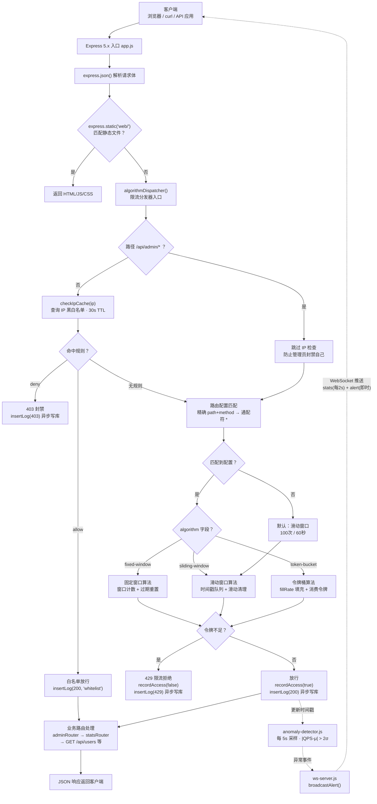

# Smart API Gateway

智能 API 网关 — 集限流、监控、异常检测于一体的轻量级网关平台。

## 功能特性

- **三种限流算法**：固定窗口、滑动窗口、令牌桶，通过数据库配置动态切换，无需重启
- **IP 黑白名单**：支持 deny/allow 规则，管理 API 豁免检查，带 30 秒缓存
- **异常检测**：基于移动平均 + 标准差（2σ 阈值），自动识别流量突增（spike）和骤降（drop）
- **实时仪表盘**：统计卡片、QPS 折线图、路径分布柱状图、异常事件表、调用日志、配置管理
- **WebSocket 推送**：每 2 秒推送统计数据，异常时即时弹出告警横幅，断线自动降级 HTTP 轮询
- **调用日志**：异步写入 SQLite，支持按状态码和时间范围筛选
- **配置热更新**：管理 API 变更后立即生效（强制刷新内存缓存）
- **压测工具**：autocannon 三算法对比 + 窗口边界攻击测试 + 异常检测验证

## 技术栈

| 层 | 技术 |
|----|------|
| 运行时 | Node.js 18+，ES 模块 |
| Web 框架 | Express 5.x |
| 数据库 | better-sqlite3（同步驱动，WAL 模式） |
| 实时推送 | ws（WebSocket） |
| 前端 | 原生 HTML/CSS/JS + Chart.js 4.x（CDN） |
| 压测 | autocannon 8.x |

## 项目架构



## 快速开始

### Docker 部署（推荐）

```bash
# 一条命令启动
docker-compose up -d

# 查看日志
docker-compose logs -f

# 停止
docker-compose down
```

首次启动会自动创建数据库并写入种子数据（限流配置 + 测试用户/商品）。

验证：
```bash
curl http://localhost:8080/api/stats
curl http://localhost:8080/api/users
```

> 安全提示：生产环境请修改 `docker-compose.yml` 中的 `JWT_SECRET` 环境变量。

### 本地开发

```bash
# 1. 克隆项目
git clone <repo-url>
cd my-gateway

# 2. 安装依赖
npm install

# 3. 初始化数据库并插入种子数据
node src/db/seed.js
node src/db/seed-config.js

# 4. 启动服务
node src/app.js
```

启动后访问：
- 仪表盘：http://localhost:8080
- 用户 API：http://localhost:8080/api/users
- 管理 API：http://localhost:8080/api/admin/rate-limits

## 项目结构

```
src/
├── middleware/
│   ├── dispatcher.js            # 算法分发器（主入口）
│   ├── rate-limiter.js          # 固定窗口
│   ├── sliding-window.js        # 滑动窗口
│   └── token-bucket.js          # 令牌桶
├── db/
│   ├── init.js                  # 建表 + WAL 模式
│   ├── config-repo.js           # 限流配置 CRUD
│   ├── log-repo.js              # 调用日志写入与查询
│   ├── ip-repo.js               # IP 黑白名单
│   ├── seed.js                  # 用户/商品/IP测试数据
│   └── seed-config.js           # 限流默认配置
├── admin/
│   └── routes.js                # 管理 API
├── routes/
│   └── stats.js                 # 统计 + 异常检测 + 日志 API
├── ml/
│   └── anomaly-detector.js      # 异常检测模块
├── ws-server.js                 # WebSocket 服务
└── app.js                       # 入口
web/
└── index.html                   # 仪表盘前端
scripts/
├── benchmark.js                 # 三算法压测
└── test-anomaly.js              # 异常检测验证
docs/
└── benchmark-report.md          # 压测报告
```

## API 文档

### 业务 API

| 方法 | 路径 | 说明 |
|------|------|------|
| GET | `/api/users` | 用户列表 |
| GET | `/api/users/:id` | 单个用户 |

### 统计与监控

| 方法 | 路径 | 参数 | 说明 |
|------|------|------|------|
| GET | `/api/stats` | — | 实时统计：totalRequests, rejectedRequests, qps, qpsHistory[60], apiDistribution |
| GET | `/api/anomalies` | — | 异常检测：baseline{mean,stdDev,sampleSize}, recentEvents[], currentStatus |
| POST | `/api/anomalies/reset` | — | 重置异常检测学习期 |
| GET | `/api/logs` | `?hours=1&status=429&limit=100` | 调用日志 + 路径分布 |

### 限流配置管理

| 方法 | 路径 | 说明 |
|------|------|------|
| GET | `/api/admin/rate-limits` | 所有配置 |
| POST | `/api/admin/rate-limits` | 新增/更新 `{path, method, maxRequests, windowMs, algorithm}` |
| PATCH | `/api/admin/rate-limits/toggle` | 启停或切换算法 `{path, method, enabled?, algorithm?}` |
| DELETE | `/api/admin/rate-limits` | 删除 `{path, method}` |

### IP 黑白名单

| 方法 | 路径 | 说明 |
|------|------|------|
| GET | `/api/admin/ip-rules` | 规则列表 |
| POST | `/api/admin/ip-rules` | 添加 `{ip, action:"allow"|"deny", note?}` |
| DELETE | `/api/admin/ip-rules/:id` | 删除规则 |

### WebSocket

```
ws://localhost:8080

消息格式：
  { type: "stats", data: { totalRequests, rejectedRequests, qps, currentStatus, ... }, timestamp }
  { type: "alert", data: { qps, anomalyType, severity, status, time }, timestamp }
```

## 数据库表

| 表名 | 说明 | 关键字段 |
|------|------|----------|
| `users` | 测试用户 | id, name, role |
| `products` | 测试商品 | id, name, price |
| `rate_limit_configs` | 限流配置 | route_path, route_method, max_requests, window_ms, algorithm, enabled |
| `api_logs` | 调用日志 | route_path, route_method, ip, status_code, algorithm, created_at |
| `ip_rules` | IP 规则 | ip, action(allow/deny), note, created_at |

## 三种限流算法对比

| 算法 | 原理 | 429 分布 | 突发支持 | 适用场景 |
|------|------|----------|----------|----------|
| 固定窗口 | 窗口内计数，到期清零 | 集中在窗口末尾 | 否 | 简单场景 |
| 滑动窗口 | 时间戳数组，清理过期 | 持续均匀 | 否 | 精确限流（推荐） |
| 令牌桶 | 恒定速率填充，消费令牌 | 桶空后平缓 | 是 | 允许突发的业务 |

压测命令：
```bash
node scripts/benchmark.js
```

## 异常检测

- **算法**：移动平均 + 标准差（2σ 阈值）
- **学习期**：启动后 30 秒（避免冷启动误报）
- **采样间隔**：每 5 秒，取最近 5 秒平均 QPS
- **告警级别**：|偏离| > 2σ → warning，|偏离| > 3σ → critical
- **自动恢复**：10 秒内无新异常 → 恢复 normal

验证命令：
```bash
node scripts/test-anomaly.js
```

## 仪表盘截图

> 浏览器打开 http://localhost:8080 查看实时仪表盘

| 区域 | 内容 |
|------|------|
| 顶部 | 4 个统计卡片（总请求数、被限次数、当前 QPS、异常状态） |
| 中部 | QPS 折线图（60 秒）+ 路径分布柱状图（1 小时） |
| Tab 1 | 异常事件表（时间、QPS、类型、偏离 σ 值） |
| Tab 2 | 调用日志（状态码/时间筛选 + 100 条记录） |
| Tab 3 | IP 管理（添加/删除规则 + 规则列表） |
| Tab 4 | 限流配置（路径/方法/限额/窗口/算法切换/启停） |
| 实时 | WebSocket 推送，标题栏显示连接状态，异常时弹出红色横幅 |

## License

ISC
